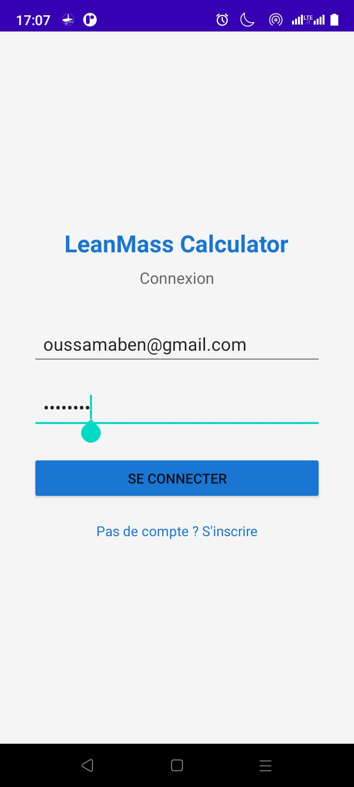

# LeanMass Calculator

## Partie 1 : Présentation du projet

### Contexte et objectifs

L'application **LeanMass Calculator** répond à un besoin concret dans le domaine de la nutrition sportive : offrir à l'utilisateur un outil simple et fiable pour estimer sa masse maigre. Le projet couvre les fonctionnalités suivantes :

- **Authentification sécurisée** : inscription et connexion d'un utilisateur.
- **Calcul du LBM** : à partir du poids, de la taille et du genre de l'utilisateur, en utilisant la méthode de Boer.
- **Retour visuel immédiat** : affichage d'une icône et d'un message selon que le résultat est satisfaisant ou non.
- **Historique des calculs** : consultation et suppression des résultats précédents.
- **Persistance double** : stockage local via SQLite ou stockage cloud via Firebase Firestore.
- **Deux variantes d'interface** : développées avec et sans `ViewBinding`.

### Formules utilisées (méthode de Boer)

Le calcul du LBM est effectué selon les formules suivantes, adaptées au genre de l'utilisateur :

- **Homme :** `LBM = (0.407 × Poids) + (0.267 × Taille) - 19.2`
- **Femme :** `LBM = (0.252 × Poids) + (0.473 × Taille) - 48.3`

Les normes indicatives utilisées pour l'interprétation du résultat sont :

- **Homme :** LBM ≥ 38 kg → Résultat satisfaisant
- **Femme :** LBM ≥ 24 kg → Résultat satisfaisant

Ces seuils sont définis dans un fichier de configuration et peuvent être ajustés facilement.

---

## Partie 2 : Implémentation de l'application

### Authentification (Inscription et Connexion)

L'application propose deux écrans d'authentification : un écran d'inscription (*Sign Up*) et un écran de connexion (*Sign In*). Ces écrans permettent à l'utilisateur de créer un compte et de s'authentifier de manière sécurisée avant d'accéder aux fonctionnalités de calcul.

#### Écran d'inscription


L'écran d'inscription demande à l'utilisateur de saisir ses informations (nom, email, mot de passe). Les données sont validées avant d'être enregistrées dans la base de données locale (SQLite) ou dans Firebase Firestore.

#### Écran de connexion



L'écran de connexion vérifie les identifiants de l'utilisateur et lui donne accès à l'application si les informations saisies correspondent à un compte existant.

### Calcul du LBM et retour visuel

Une fois connecté, l'utilisateur peut saisir son poids (en kg), sa taille (en cm) et son genre. L'application calcule automatiquement son LBM selon la méthode de Boer et affiche le résultat accompagné d'un retour visuel immédiat.

#### Résultat satisfaisant

Lorsque la valeur calculée respecte les normes indicatives (LBM ≥ 38 kg pour un homme, LBM ≥ 24 kg pour une femme), l'application affiche une icône de satisfaction et le message *« Résultat satisfaisant »*.

| Résultat satisfaisant — vue 1 | Résultat satisfaisant — vue 2 |
|------------------------------|------------------------------|
|  |  |

#### Résultat à surveiller

Lorsque la valeur calculée est inférieure aux normes, l'application affiche une icône d'avertissement et le message *« Résultat à surveiller »*, invitant l'utilisateur à prêter attention à sa composition corporelle.

| Résultat insatisfaisant — vue 1 | Résultat insatisfaisant — vue 2 |
|-------------------------------|-------------------------------|
|  |  |

### Implémentation Kotlin — Logique de calcul

La logique principale du calcul est encapsulée dans une fonction Kotlin simple et lisible. Voici un extrait représentatif de l'implémentation :

```kotlin
fun calculerLBM(poids: Double, taille: Double, genre: String): Double {
    return if (genre == "Homme") {
        (0.407 * poids) + (0.267 * taille) - 19.2
    } else {
        (0.252 * poids) + (0.473 * taille) - 48.3
    }
}

fun estSatisfaisant(lbm: Double, genre: String): Boolean {
    val seuil = if (genre == "Homme") 38.0 else 24.0
    return lbm >= seuil
}
