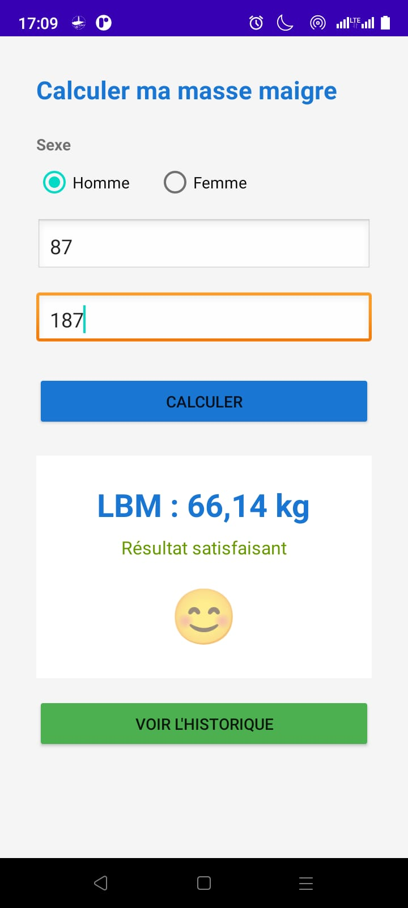
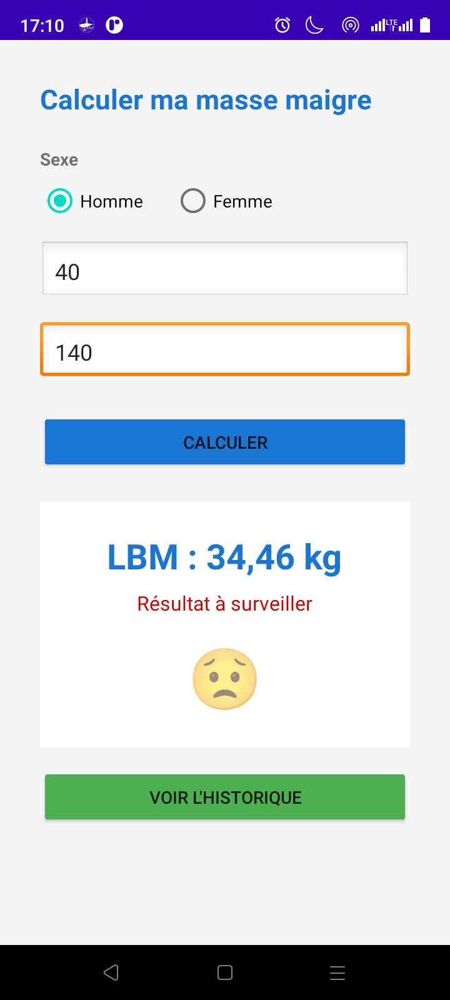

# LeanMass Calculator

## Part 1: Project Presentation

### Context and Objectives

The **LeanMass Calculator** application addresses a concrete need in the field of sports nutrition: providing users with a simple and reliable tool to estimate their lean body mass. The project covers the following features:

- **Secure Authentication**: user registration and login.
- **LBM Calculation**: based on the user's weight, height, and gender, using the Boer method.
- **Immediate Visual Feedback**: display of an icon and message depending on whether the result is satisfactory or not.
- **Calculation History**: view and delete previous results.
- **Local Persistence**: local storage via SQLite.
- **Two Interface Variants**: developed with and without `ViewBinding`.

### Formulas Used (Boer Method)

LBM calculation is performed using the following formulas, adapted to the user's gender:

- **Male:** `LBM = (0.407 × Weight) + (0.267 × Height) - 19.2`
- **Female:** `LBM = (0.252 × Weight) + (0.473 × Height) - 48.3`

The indicative standards used for result interpretation are:

- **Male:** LBM ≥ 38 kg → Satisfactory result
- **Female:** LBM ≥ 24 kg → Satisfactory result

These thresholds are defined in a configuration file and can be easily adjusted.

---

## Part 2: Application Implementation

### Authentication (Sign Up and Sign In)

The application offers two authentication screens: a Sign Up screen and a Sign In screen. These screens allow the user to create an account and authenticate securely before accessing the calculation features.

#### Sign Up Screen

The Sign Up screen asks the user to enter their information (name, email, password). The data is validated before being saved to the local SQLite database.

#### Sign In Screen

The Sign In screen verifies the user's credentials and grants access to the application if the entered information matches an existing account.

### LBM Calculation and Visual Feedback

Once logged in, the user can enter their weight (in kg), height (in cm), and gender. The application automatically calculates their LBM using the Boer method and displays the result with immediate visual feedback.

#### Satisfactory Result

When the calculated value meets the indicative standards (LBM ≥ 38 kg for a male, LBM ≥ 24 kg for a female), the application displays a satisfaction icon and the message "Satisfactory result".

**Satisfactory result — view**

#### Result to Monitor

When the calculated value is below the standards, the application displays a warning icon and the message "Result to monitor", inviting the user to pay attention to their body composition.

**Unsatisfactory result — view **

